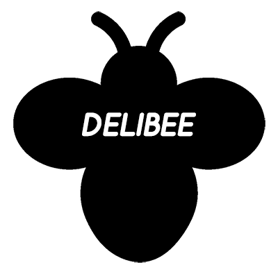

# Delibee

[![NPM Version][npm-image]][npm-url]
[![NPM Downloads][downloads-image]][downloads-url]
[![Build Status][travis-image]][travis-url]
[![Test Coverage][coveralls-image]][coveralls-url]

<p align="center">
    <br>
    Delivery tracking library on Node.js.
</p> 

## Prerequisites
Node.js >= 7.6

## Issues
Feel free to submit issues and enhancement requests.

## Usage
> npm install delibee

### On Express Framework
```
const express = require('express')
const delibee = require('delibee')({
  timeout: 10000
})
const app = express()

app.get('/tracking/companies', async (req, res) => {
  const companies = await delibee.company()
  res.send(companies)
})

app.get('/tracking', async (req, res) => {
  const company = req.query.company
  const invoiceNo = req.query.invoice_no
  const invoice = await delibee.tracking(company, invoiceNo)
  res.send(invoice)
})

app.listen(3000)
```
#### Http Request Example
> http://127.0.0.1:3000/tracking?company={delivery_company_code}&invoice_no={invoice_number}

## Delivery Company Code
Company Name | Comapny Code
---- | ----
우체국택배 | EPOST
CJ대한통운 | CJ
한진택배 | HANJIN
롯데택배 (구. 현대택배) | LOTTE
로젠택배 | LOGEN
KG로지스 | LOGIS

## Response
Key | Description
---- | ----
deliveryCompany | 택배회사정보
invoiceNumber | 송장번호
senderName | 보낸이
senderAddr | 출발지/주소
receiverName | 받는이
receiverAddr | 도착지/주소
statusCode | 배송상태코드
statusText | 배송상태
history | 배송내역

### DeliveryCompany
Key | Description
---- | ----
code | 택배회사코드
name | 택배회사

### History
Key | Description
---- | ----
dateTime | 시간 (timestamp)
dateString | 시간 (YYYY.MM.DD HH:mm)
location | 위치
tel | 전화번호
remark | 택배사 제공 상태 한마디
statusCode | 배송상태코드
statusText | 배송상태

### Status
StatusCode | StatusText
---- | ----
-1 | 알수없음
10 | 접수 대기
11 | 잔류
20 | 접수
30 | 집하
40 | 배송중(출고)
50 | 배송중(입고)
55 | 오도착
60 | 배달준비중
65 | 배달중
70 | 배달완료
71 | 미배달
80 | 인수확인

### Response Expample 
```
{
  "success": true,
  "invoice": {
    "deliveryCompany": {
      "code": "CJ",
      "name": "CJ대한통운"
    },
    "invoiceNumber": "340925749694",
    "senderName": "밴*",
    "senderAddr": "",
    "receiverName": "전*",
    "receiverAddr": "",
    "statusCode": 70,
    "statusText": "배달완료",
    "history": [
      {
        "dateTime": 1510831320000,
        "dateString": "2017.11.16 20:22",
        "location": "광진직영(엄현철)",
        "tel": "",
        "remark": "집화처리",
        "statusCode": 30,
        "statusText": "집하"
      },
      {
        "dateTime": 1510862940000,
        "dateString": "2017.11.17 05:09",
        "location": "부곡4CP",
        "tel": "",
        "remark": "간선상차",
        "statusCode": 40,
        "statusText": "배송중(출고)"
      },
      {
        "dateTime": 1510882260000,
        "dateString": "2017.11.17 10:31",
        "location": "부평",
        "tel": "",
        "remark": "간선하차",
        "statusCode": 50,
        "statusText": "배송중(입고)"
      },
      {
        "dateTime": 1510885140000,
        "dateString": "2017.11.17 11:19",
        "location": "인천가좌",
        "tel": "",
        "remark": "배달출발 (배달예정시간:20∼22시)",
        "statusCode": 65,
        "statusText": "배달중"
      },
      {
        "dateTime": 1510903800000,
        "dateString": "2017.11.17 16:30",
        "location": "인천가좌",
        "tel": "",
        "remark": "배달완료",
        "statusCode": 70,
        "statusText": "배달완료"
      }
    ]
  }
}
```

## Contributing
Bug reports and pull requests are welcome on GitHub at https://github.com/flosdor/delibee

 1. **Fork** the repo on GitHub
 2. **Clone** the project to your own machine
 3. **Commit** changes to your own branch
 4. **Push** your work back up to your fork
 5. Submit a **Pull request** so that we can review your changes

NOTE: Be sure to merge the latest from "upstream" before making a pull request!

Contributors
----
Company Name | Contributor
---- | ----
우체국택배 | @flosdor
CJ대한통운 | @flosdor
한진택배 | @flosdor
롯데택배 (구. 현대택배) | @flosdor
로젠택배 | @flosdor
KG로지스 | @flosdor


## License

[MIT LICENSE](LICENSE)

[npm-image]: https://img.shields.io/npm/v/delibee.svg
[npm-url]: https://npmjs.org/package/delibee
[travis-image]: https://img.shields.io/travis/flosdor/delibee/master.svg
[travis-url]: https://travis-ci.org/flosdor/delibee
[coveralls-image]: https://coveralls.io/repos/github/flosdor/delibee/badge.svg
[coveralls-url]: https://coveralls.io/github/flosdor/delibee
[downloads-image]: https://img.shields.io/npm/dm/delibee.svg
[downloads-url]: https://npmjs.org/package/delibee
